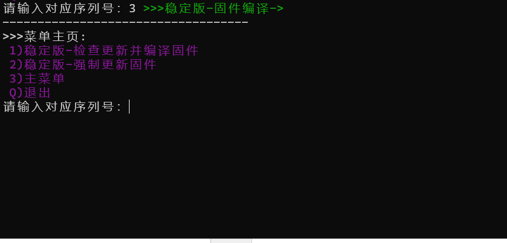

# Openwrt_Update
Openwrt 固件一键检测更新/编译固件脚本！推荐 Ubuntu 18+ x64

【运行脚本请保证网络能科学】【固件默认x86-64架构·不要在root账户下运行】

【IP:192.168.1.2 USER:root PASSWD:password】

1.平台是基于win10 wsl2环境的linux 当然也可以运行到其他地方Linux上;

2.脚本升级为一键按傻瓜操作，无需自己配置，只需要准备好良好网络和一台充满能量的linux系统PC;

3.初次编译会花费很长时间，一般大约3-4小时，请耐心等待，不要惊慌失措，百无聊赖至于可以进群吹水打发时间；

4.一键脚本运行：

    cd && bash -c "$(wget -O- https://git.io/Jt3f6)"

5.若有问题讨论群：https://t.me/openwrt_lede_v2ray_plugin

6.附录部分图片：

